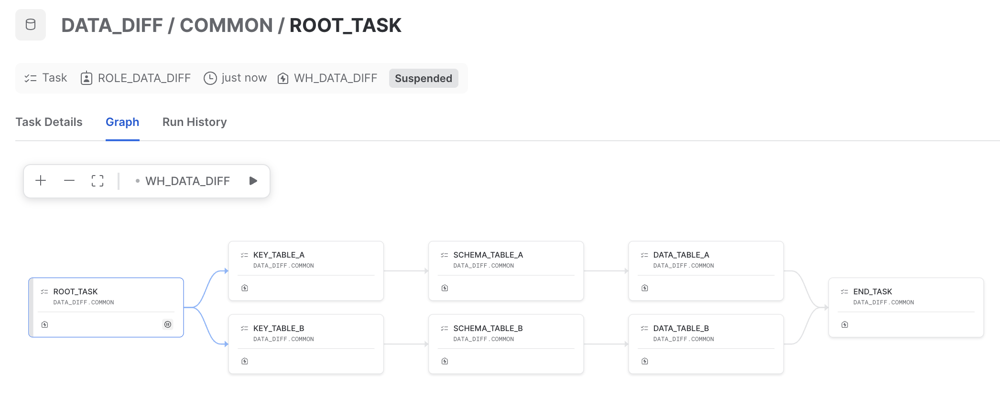

<!-- markdownlint-disable no-inline-html no-alt-text -->
# dbt-data-diff

- [dbt-data-diff](#dbt-data-diff)
  - [Core Concept 🌟](#core-concept-)
  - [Installation](#installation)
  - [Quick Demo](#quick-demo)
    - [1. Configure the tables that need comparing in `dbt_project.yml`](#1-configure-the-tables-that-need-comparing-in-dbt_projectyml)
    - [2. Refresh the configured tables's data](#2-refresh-the-configured-tabless-data)
    - [3. Trigger the validation via dbt operation](#3-trigger-the-validation-via-dbt-operation)
  - [How to Contribute](#how-to-contribute)
  - [Features comparison to the alternative packages](#features-comparison-to-the-alternative-packages)
  - [About Infinite Lambda](#about-infinite-lambda)

Data-diff solution for dbt-ers with Snowflake ❄️ 🚀

**_Who is this for?_**

- Primarily for people who want to perform Data-diff validation on **[the Blue-Green deployment](https://discourse.getdbt.com/t/performing-a-blue-green-deploy-of-your-dbt-project-on-snowflake/1349)** 🌟
- Other good considerations 👍
  - UAT validation: data-diff with PROD
  - Code-Refactoring validation: data diff between old vs new
  - Migration to Snowflake: data diff between old vs new (requires to land the old data to Snowflake)
  - CI: future consideration only ⚠️

## Core Concept 🌟

`dbt-data-diff` package provides the diff results into 3 categories or 3 levels of the diff as follows:

- 🥉 **Key diff** ([models](./models/01_key_diff/)): Compare the Primary Key (`pk`) only
- 🥈 **Schema diff** ([models](./models/02_schema_diff/)): Compare the list of column's Names and Data Types
- 🥇 **Content diff** (aka Data diff) ([models](./models/03_content_diff/)): Compare all cell values. The columns will be filtered by each table's configuration (`include_columns` and `exclude_columns`), and the data can be also filtered by the `where` config. Behind the scenes, this operation does not require the Primary Key (PK) config, it will perform Bulk Operation (`INTERCEPT` or `MINUS`) and make an aggregation to make up the column level's match percentage

Behind the scenes, this package leverages the ❄️ [Scripting Stored Procedure](https://docs.snowflake.com/en/developer-guide/stored-procedure/stored-procedures-snowflake-scripting) which provides the 3 ones correspondingly with 3 categories as above. Moreover, it utilizes the [DAG of Tasks](https://docs.snowflake.com/en/user-guide/tasks-intro?utm_source=legacy&utm_medium=serp&utm_term=task+DAG#label-task-dag) to optimize the speed with the parallelism once enabled by configuration 🚀



## Installation

- Add to `packages.yml` file:

```yml
packages:
  - package: infinitelambda/dbt-data-diff
    version: [">=1.0.0", "<1.1.0"]
```

- (Optional) Configure database & schema in `dbt_project.yml` file:

```yml
vars:
  # (optional) default to `target.database` if not specified
  data_diff__database: COMMON
  # (optional) default to `target.schema` if not specified
  data_diff__schema: DATA_DIFF
```

- Create/Migrate the `data-diff`'s DDL resources

```bash
dbt deps
dbt run -s data_diff --vars '{data_diff__on_migration: true}'
```

## Quick Demo

### 1. Configure the tables that need comparing in `dbt_project.yml`

We're going to use the `data_diff__configured_tables` variable (Check out the [dbt_project.yml](./dbt_project.yml)/`vars`` section for more details!)

For example, we want to compare `table_x` between **prod** db and **dev** one:

```yaml
vars:
  data_diff__configured_tables:
    - src_db: your_prod
      src_schema: your_schema
      src_table: table_x
      trg_db: your_dev
      trg_schema: your_schema
      trg_table: table_x
      pk: key # multiple columns splitted by comma
      include_columns: [] # [] to include all
      exclude_columns: ["loaded_at"] # [] to exclude loaded_at field
```

### 2. Refresh the configured tables's data

We can skip this step if you already did it. If not, let's run the below command:

```bash
dbt run -s data_diff \
  --full-refresh \
  --vars '{data_diff__on_migration: true, data_diff__on_migration_data: true, data_diff__full_refresh: true}'
```

<details>
  <summary>📖 click me</summary>

In the above:

- `--full-refresh` and `data_diff__full_refresh`: To re-create all data-diff models
- `data_diff__on_migration: true`: To re-create the stored procedures
- `data_diff__on_migration_data: true`: To reset the configured data

</details>

### 3. Trigger the validation via dbt operation

Now, let's start the diff run:

```bash
dbt run-operation data_diff__run        # normal mode, run in sequence, wait unitl finished
# OR
dbt run-operation data_diff__run_async  # async mode, parallel, no waiting
dbt run-operation data_diff__run_async --args '{is_polling_status: true}'
                                        # async mode, parallel, status polling
```

> **NOTE**: In async mode, we leverage the DAG of tasks, therefore the dbt's ROLE will need granting the addtional privilege:</br></br>
> `use role accountadmin;`<br>
> `grant execute task on account to role {{ target.role }};`</br>

<details>
  <summary>📖 Or via dbt hook by default (it will run an incremental load for all models)</summary>

```yaml
# dbt_project.yml

# normal mode
on-run-end
  - > # run data-diff hook
    
      {{ data_diff.data_diff__run(in_hook=true) }}
    

# async mode
on-run-end
  - > # run data-diff hook
    
      {{ data_diff.data_diff__run_async(in_hook=true) }}
    

```

```bash
# terminal
dbt run -s data_diff --vars '{data_diff__on_run_hook: true}'
```

</details>

[](TODO)

## How to Contribute

`dbt-data-diff` is an open-source dbt package. Whether you are a seasoned open-source contributor or a first-time committer, we welcome and encourage you to contribute code, documentation, ideas, or problem statements to this project.

👉 See [CONTRIBUTING guideline](https://data-diff.iflambda.com/latest/nav/dev/contributing.html) for more details or check out [CONTRIBUTING.md](./CONTRIBUTING.md)

🌟 And then, kudos to **our beloved Contributors**:

<a href="https://github.com/infinitelambda/dbt-data-diff/graphs/contributors">
  
</a>

## Features comparison to the alternative packages

| Feature               | Supported Package                                          | Notes                                 |
|:----------------------|:-----------------------------------------------------------|:--------------------------------------|
| Key diff              | <ul><li>`dbt_data_diff`</li><li>[`data_diff`](https://github.com/datafold/data_diff)</li><li>[`dbt_audit_helper`](https://github.com/dbt-labs/dbt_audit_helper)</li></ul> | ✅                                   |
| Schema diff           | <ul><li>`dbt_data_diff`</li><li>[`data_diff`(*)](https://github.com/datafold/data_diff)</li><li>[`dbt_audit_helper`](https://github.com/dbt-labs/dbt_audit_helper)</li></ul> | (*): Only available in the paid-version 💰 |
| Content diff          | <ul><li>`dbt_data_diff`</li><li>[`data_diff`(*)](https://github.com/datafold/data_diff)</li><li>[`dbt_audit_helper`](https://github.com/dbt-labs/dbt_audit_helper)</li></ul> | (*): Only available in the paid-version 💰 |
| Yaml Configuration    | <ul><li>`dbt_data_diff`</li></ul>                           | `data_diff` will use the `toml` file, `dbt_audit_helper` will require to create new models for each comparison |
| Query & Execution log  | <ul><li>`dbt_data_diff`</li></ul>                           | Except for dbt's log, this package to be very transparent on which diff queries executed which are exposed in [`log_for_validation`](./models/log_for_validation.yml) model |
| Snowflake-native Stored Proc | <ul><li>`dbt_data_diff`</li></ul>                      | Purely built as Snowflake SQL native stored procedures |
| Parallelism           | <ul><li>`dbt_data_diff`</li><li>[`data_diff`](https://github.com/datafold/data_diff)</li><li>[`dbt_audit_helper`](https://github.com/dbt-labs/dbt_audit_helper)</li></ul> | `dbt_data_diff` leverages Snowflake Task DAG, the others use python threading |
| Asynchronous          | <ul><li>`dbt_data_diff`</li></ul>                           | Trigger run & go away. Decide to continously poll the run status and waiting until finished if needed |
| Multi-warehouse supported | <ul><li>`dbt_data_diff`(*)</li><li>[`data_diff`](https://github.com/datafold/data_diff)</li><li>[`dbt_audit_helper`](https://github.com/dbt-labs/dbt_audit_helper)</li></ul> | (*): Future Consideration 🏃 |

## About Infinite Lambda

Infinite Lambda is a cloud and data consultancy. We build strategies, help organizations implement them, and pass on the expertise to look after the infrastructure.

We are an Elite Snowflake Partner, a Platinum dbt Partner, and a two-time Fivetran Innovation Partner of the Year for EMEA.

Naturally, we love exploring innovative solutions and sharing knowledge, so go ahead and:

🔧 Take a look around our [Git](https://github.com/infinitelambda)

✏️ Browse our [tech blog](https://infinitelambda.com/category/tech-blog/)

We are also chatty, so:

👀 Follow us on [LinkedIn](https://www.linkedin.com/company/infinite-lambda/)

👋🏼 Or just [get in touch](https://infinitelambda.com/contacts/)

[](https://infinitelambda.com/)
